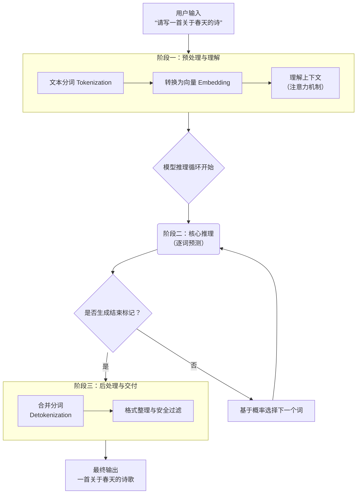
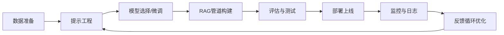


---
title: 大模型技术全景与核心概念解析：从基础原理到AI智能体架构
date: 2026-05-24 08:00:00
tags:
  - "大模型"
  - "AI智能体"
  - "人工智能"
categories:
  - "人工智能"
---

# 大模型技术全景与核心概念解析：从基础原理到AI智能体架构


## 📖 概念索引与要点概览

| 概念                                       | 核心定义                                                     | 主要作用与意义                                               |
| :----------------------------------------- | :----------------------------------------------------------- | :----------------------------------------------------------- |
| **LLM（大语言模型）**                      | 基于海量文本训练、能理解与生成自然语言的深度学习模型。       | 现代AI语言能力的核心，支撑各类文本生成与理解任务。           |
| **LLMOps**                                 | **大语言模型运维**，涵盖LLM应用开发、部署、监控与维护的全流程工程实践。 | 确保LLM应用稳定、高效、可靠运行，连接模型研发与实际业务落地。 |
| **FMOps**【NEW】                           | **基础模型运维**，LLMOps的上位概念，涵盖LLM、视觉模型等多模态基础模型的运维管理。 | 为企业级AI系统提供统一的运维框架，支持多类型基础模型的选型、运营与管理。 |
| **AIGC（人工智能生成内容）**               | 利用AI自动生成文本、图像、音频、视频等内容的技术。           | 推动内容创作自动化，赋能创意产业与数字内容生产。             |
| **AGI（通用人工智能）**                    | 具备与人类相当或超越人类的全面认知能力的AI系统。             | AI研究的长期目标，追求人类级别的通用智能。                   |
| **AI智能体（Agent）**                      | 能够感知环境、进行决策并执行动作，以自主完成特定目标的AI系统。 | 将大模型能力转化为自主思考和行动的实体，是AI技术的应用落地方向。 |
| **Agentic AI**【NEW】                      | **能动人工智能**，AI系统从被动对话工具向主动协作伙伴转变的范式。 | 代表AI从“聊天机器人”到“端到端任务执行者”的质变，是2026年企业AI落地的核心范式。 |
| **Prompt（提示词）**                       | 用户输入给模型的指令或问题，用于引导模型生成特定输出。       | 决定模型输出质量与方向的关键输入，是"引导"模型思考的指令。   |
| **Token（标记）**                          | **文本处理的基本单位**，由分词器（Tokenizer）将文本拆分而成。 | 模型理解与生成的"语言"单位；API计算与计费的基础。            |
| **B（FLOPs单位）**                         | **十亿次浮点运算**，是衡量模型**计算复杂度或计算量**的常用单位。 | 量化模型推理或训练的"工作量"，是评估算力需求与成本的核心指标。 |
| **Test-Time Compute**【NEW】               | **测试时计算扩展**，在推理阶段分配额外计算资源（重复采样、搜索、延长推理）来提升模型性能的技术。 | 打破“更多参数=更强性能”的范式，让小型模型通过“思考更久”获得大型模型级的能力。 |
| **LoRA（低秩适应）**                       | 一种高效微调大模型的技术，通过插入低秩矩阵更新部分参数。     | 大幅降低大模型微调成本，使个性化适配更可行。                 |
| **DPO（直接偏好优化）**【NEW】             | **Direct Preference Optimization**，一种绕过显式奖励模型的偏好对齐方法，取代PPO成为业界“版本之子”。 | 无需训练独立奖励模型，大幅简化RLHF流程，是Llama-3、Mistral等主流开源模型的标准对齐技术。 |
| **矢量/向量数据库**                        | 专门用于存储和检索高维向量（如Embedding向量）的数据库。      | 支撑语义搜索、RAG等应用，实现基于内容相似性的高效检索。      |
| **GraphRAG**【NEW】                        | **知识图谱增强检索**，在传统向量RAG基础上引入结构化知识图谱，构建“语义向量+图谱关系”双通道检索机制。 | 突破传统RAG对语义相似度的依赖，通过多跳推理和实体关系导航获取更精准、更具上下文深度的检索结果。 |
| **数据蒸馏**                               | 从大规模数据或模型中提取核心知识，用于训练更小、更高效的模型。 | 模型压缩与知识迁移的关键技术，平衡性能与效率。               |
| **Embedding（嵌入）**                      | 将文本映射为高维向量的过程，捕捉语义信息。                   | 文本的数学表示，使语义计算成为可能。                         |
| **MoE（混合专家模型）**                    | 一种**稀疏神经网络架构**，由多个"专家"子网络和一个"门控网络"组成。 | 以**接近小模型的成本**，获得**媲美超大模型的能力**，突破模型规模的瓶颈。 |
| **MCP（模型上下文协议）**                  | 一个**标准化的通信协议**，用于大模型安全、便捷地调用外部工具和数据源。 | 构建**AI智能体**的"连接器"与"安全员"，被业界称为"AI界的USB-C标准"。 |
| **多智能体系统（MAS）**【NEW】             | **Multi-Agent System**，由多个专业化智能体组成的分布式协作网络，各智能体各司其职、协同完成复杂任务。 | 2026年企业AI的分水岭——从单体智能体转向可编排、可协同、可治理的多智能体系统。 |
| **ACI（Agent-Computer Interface）**【NEW】 | **智能体-计算机接口**，定义AI智能体如何与操作系统、应用程序和文件系统交互的接口规范。 | 让AI智能体从“代码补全工具”进化为能够完整执行开发任务的“AI软件工程师”。 |
| **Copilot（辅助编程）**                    | 基于大模型的代码生成与补全工具，如GitHub Copilot。           | 提升开发者效率的AI编程助手，是AI在垂直领域的典型应用。       |
| **Harness Engineering**【NEW】             | **牵引导航工程**，通过外部化框架约束和引导AI智能体行为，实现稳定、可控的自动化执行的工程范式。 | 解决AI智能体在生产环境中“乱来跟瞎搞”的问题，是AI从“实验室玩具”走向“生产工具”的关键。 |
| **AI智能体可观测性**【NEW】                | 对AI智能体的意图、推理过程、约束条件和执行结果进行结构化追踪与监控的能力。 | 解决AI智能体在生产环境中的“语义黑盒”问题，实现问题的定位与系统的优化。 |

---

## 一、大模型基础概念全景

### 1.1 LLM（大语言模型）

大语言模型是基于Transformer架构、在海量文本数据上预训练的深度学习模型。它通过自监督学习掌握语言规律，能够理解、生成和推理自然语言，是当前AI技术的核心基础。

### 1.2 LLMOps 与 FMOps【NEW】

LLMOps是MLOps在大型语言模型领域的扩展，专注于LLM应用的全生命周期管理。与之并行发展的是**FMOps（Foundation Model Operations）** ，作为LLMOps的上位概念，它为LLM、视觉模型、多模态模型等各类基础模型提供了统一的运维框架。

### 1.3 AIGC（人工智能生成内容）

AIGC指利用AI技术自动生成各类内容，包括文本、图像、音频、视频、代码等。大语言模型是AIGC在文本领域的主要实现方式，正推动内容创作进入自动化时代。

### 1.4 AGI（通用人工智能）

AGI是具备人类水平认知能力的AI系统，能跨领域学习、推理和解决问题。当前的大模型虽在某些任务上表现出色，但距真正的AGI仍有距离，AI智能体是其重要演进方向。

### 1.5 AI智能体（Agent）概述

AI智能体是具备自主感知、决策和执行能力的AI系统。它不仅是对话工具，更是能主动思考、规划和行动的智能实体，代表了大模型能力的终极应用形态。

### 1.6 Agentic AI【NEW】

**Agentic AI（能动人工智能）** 是2026年AI领域的核心范式变革，标志着AI系统从对话伙伴（Conversation Partners）向主动协作伙伴（Active Collaborators）的转型。Agentic AI能够端到端地执行复杂任务，涉及软件工程、科学发现和机器人等领域的全流程自动化。

### 1.7 Harness Engineering（牵引导航工程）【NEW】

**Harness Engineering**是2026年AI工程化领域的重要范式突破，聚焦于通过外部化框架对AI智能体进行约束与引导，确保其在复杂生产环境中稳定、可控地运行。Harness Engineering强调对多模态模型、实时数据流与边缘-云协同能力的统一调度与韧性管控，将智能体从“不可预测的实验品”转变为“可信任的生产工具”。其核心思想已在智能体可观测性、分层可变性框架等方向得到系统性发展。

### 1.8 Prompt（提示词）工程

提示词是与大模型交互的核心界面。好的提示词能显著提升模型输出质量，涉及指令设计、上下文提供、示例选择等技巧，是发挥模型潜力的关键。


## 二、大模型工作原理详解

### 2.1 核心工作流程图



### 2.2 四大关键阶段详解

#### 阶段零：训练（模型的"学习"过程）

1. **预训练**：在海量互联网文本上，以"完形填空"的方式进行自监督学习
2. **对齐训练（微调）** ：使用人类标注数据，通过RLHF、DPO等技术让模型变得"有用、诚实、无害"

#### 阶段一：预处理与理解

1. **分词**：将输入文本拆分成词元（Token）
2. **向量化**：将词元转换为高维向量（Embedding）
3. **编码与上下文理解**：通过Transformer的自注意力机制理解语义关系

#### 阶段二：核心推理（逐词生成循环）

1. **自回归生成**：基于已生成文本预测下一个词
2. **概率采样**：根据温度参数从概率分布中选择下一个词
3. **循环终止**：遇到结束标记或达到最大长度时停止

#### 阶段三：后处理与交付

1. **词元合并**：将词元序列转换回自然文字
2. **格式整理与安全过滤**：确保输出格式美观、内容安全

### 2.3 Test-Time Compute（测试时计算扩展）【NEW】

**Test-Time Compute**是2026年大模型推理领域的重要创新范式。传统观念认为提升模型性能的唯一途径是增加预训练计算量——更多参数、更多数据。而测试时计算扩展通过在推理阶段分配额外计算资源（如重复采样、搜索树、延长推理链），让模型“思考更久”来获得更好的结果。

这一范式的核心价值在于：

- **让小型模型（SLM）通过“思考更久”获得大型模型级能力**：测试时计算扩展使资源受限的小模型能够通过显式推理达到更大规模模型的性能水平。
- **外推能力是关键**：真正的潜力在于模型在困难问题上“思考”的时间超过其训练时的最大Token预算后，性能仍然持续提升。
- **自适应分配**：业界正在探索混合策略（如“仅在必要时深度思考”），在效果与效率之间取得平衡。

### 2.4 Transformer架构与注意力机制

Transformer是现代LLM的基石，其核心是**自注意力机制**，允许模型在处理一个词时"关注"输入中所有相关的词，从而真正理解上下文和长距离依赖关系。


## 三、核心概念深度解析

### 3.1 Token与词表

#### Token：大模型的"语言"单位

Token是文本处理的基本单位，其分词原理采用**子词(Subword)**算法：

- **BPE (Byte Pair Encoding)**：通过合并高频相邻符号构建词汇表（GPT系列采用）
- **WordPiece**：基于概率合并的策略（BERT采用）
- **Unigram Language Model**：从大词汇表逐步裁剪得到目标词表

#### 词表：大模型的"内部词典"

词表包含模型能认识的所有基本文本单位（词元），每个词元有唯一ID。它是连接自然语言与数学计算的桥梁。

### 3.2 B（FLOPs）：计算工作量单位

B是衡量模型算力需求的关键单位，指**十亿次浮点运算**。

**核心公式**：处理1个Token ≈ `6 * N` FLOPs（N为参数量，以十亿为单位）

**示例**：70亿参数模型处理1个Token ≈ 42B FLOPs（420亿次运算）

### 3.3 Embedding：文本的数学表示

Embedding是将文本映射为高维向量的过程，每个向量在"语义空间"中有特定坐标，封装了词的语义和语法信息。这是模型处理文本的数学基础。

### 3.4 LoRA：高效微调技术

LoRA通过插入低秩矩阵更新部分参数，而非全量微调，能：

- 减少90%以上可训练参数
- 大幅降低显存需求
- 保持模型性能基本不变
- 支持多个任务适配器快速切换

### 3.5 DPO与偏好对齐技术【NEW】

**DPO（Direct Preference Optimization，直接偏好优化）** 在2025-2026年间已超越PPO，成为大模型后训练阶段的“版本之子”。DPO的核心创新在于绕过显式的奖励模型训练，直接从偏好数据中优化模型，大幅简化了RLHF流程并降低了计算成本。这一方法被广泛应用于Llama-3、Mistral等主流开源模型的对齐训练。

DPO生态已衍生出多项改进技术：

- **DDPO（Debiased DPO）**：引入偏差修正机制，消除偏好数据中的系统性偏差
- **TI-DPO**：引入Token级别的重要性评估，解决“只看总分不看细节”的问题
- **RMO（Reward Margin Optimization）**：重塑奖励边际分布，增强模型的判别能力
- **wDPO**：采用分层Winsorization方法，提升对噪声数据的鲁棒性

### 3.6 思维链（CoT）及其衍生【NEW】

**思维链（Chain-of-Thought, CoT）** 是增强大模型推理能力的关键技术。2026年，CoT领域涌现了多个重要演进方向：

- **Latent CoT**：在潜在空间中进行推理，避免低效的Token级显式推理
- **D-CoT（Disciplined CoT）**：通过控制标签强制结构化推理过程，实现更高效的推理
- **EndoCoT**：将CoT机制引入扩散模型，通过迭代探索语义潜在空间实现自引导推理


## 四、高级架构与协议

### 4.1 MoE：混合专家模型

MoE通过**稀疏激活**突破模型规模瓶颈：

**核心机制**：

- 大量独立的前馈神经网络（专家）
- 门控网络动态选择Top-K专家计算
- 其余专家保持"休眠"

**核心优势**：总参数量可达万亿级别，但激活参数量仅相当于小模型，实现"大容量、低成本"。

**代表模型**：Switch Transformer、GLaM、Mixtral-8x7B

### 4.2 MCP：模型上下文协议

MCP是大模型连接外部世界的标准化接口：

**解决的问题**：工具调用接口混乱、安全权限管理困难

**工作方式**：定义工具描述、调用和结果返回的标准格式，MCP服务器提供工具并执行操作。

**最新进展**：2026年，MCP已从面向开发者的本地自动化工具，向企业级、高安全性、支持分布式长耗时执行协议的战略跃迁。

**配置示例**：

```json
{
  "mcpServers": {
    "file_system": {
      "command": "npx",
      "args": ["-y", "@modelcontextprotocol/server-filesystem", "/允许访问的目录路径"]
    }
  }
}
```

### 4.3 GraphRAG：知识图谱增强检索【NEW】

传统向量RAG依赖语义相似度进行检索，在处理需要多跳推理和跨实体关联的复杂问题时存在局限。**GraphRAG（知识图谱增强检索）** 通过引入结构化知识网络，构建了“语义向量+图谱关系”的双通道检索机制。

GraphRAG的三大核心模块：

1. **动态图谱构建引擎**：将非结构化文本自动解析为实体-关系-实体（ERG）三元组网络
2. **多跳推理层**：支持沿着图谱路径进行推理，获取超越语义相似度的深层关联
3. **混合检索器**：同时使用向量检索和图谱遍历，综合排序后返回最相关结果

### 4.4 LLMOps：大语言模型运维

LLMOps是确保LLM应用从开发到生产全链路稳定运行的关键实践体系。

#### LLMOps工作流



#### 关键组件与挑战

1. **提示版本控制**：跟踪和管理提示词变更，确保可复现性
2. **评估框架**：自动化评估生成质量、相关性、安全性
3. **成本优化**：监控Token使用量，优化提示和缓存策略
4. **性能监控**：跟踪延迟、吞吐量、错误率等SLA指标
5. **安全合规**：内容过滤、数据泄露防护、合规性检查

#### 典型LLMOps工具栈

- **实验跟踪**：Weights & Biases、MLflow
- **评估平台**：LangSmith、Ragas、DeepEval
- **部署平台**：Modal、Replicate、Banana
- **监控工具**：Datadog、Grafana、OpenTelemetry
- **编排框架**：LangChain、LlamaIndex


## 五、AI智能体：从概念到实现

### 5.1 核心特征

1. **自主性**：在较少干预下独立运行
2. **感知能力**：通过多种方式获取和理解信息
3. **推理与规划**：逻辑思考与任务分解能力
4. **行动与执行**：调用工具改变环境
5. **记忆与学习**：从经验中学习调整行为


### 5.2 AI Skills（智能体技能）：智能体的模块化能力栈

智能体技能是 AI 智能体为完成特定任务所需具备的**模块化、可组合的能力集合**。你可以将其理解为智能体的“能力栈”或“技能包”，它封装了从感知、规划到执行、反思等一系列操作指令和最佳实践。通过调用和组合不同的技能，智能体能够应对复杂的现实任务。

技能的核心价值在于将**隐性的、分散的专家知识**（如代码规范、部署流程、设计原则）转化为**显式的、可复用的标准化指令**，从而确保智能体行为的一致性、专业性并实现自动化。

#### 技能的核心作用与设计原则

一个设计良好的技能应遵循以下原则，这些原则与你关注的 Skill 最佳实践文档高度一致：

- **单一职责**：每个技能专注于一个明确的领域（如“代码审查”、“日志分析”），避免功能混杂。
- **边界清晰**：明确定义技能的**触发条件**（何时使用）和**禁用场景**（何时不使用），以提高智能体调用的准确性。
- **指令可执行**：提供具体、分步的动作指令，而非概括性描述，确保智能体可以逐步操作。
- **输入输出结构化**：明确定义技能所需的输入和产生的输出格式，类似于函数签名，保证交互的确定性。

#### 技能类型详解与应用

| 技能类型           | 具体能力与实现方式                                           | 应用示例与技术关联                                           |
| :----------------- | :----------------------------------------------------------- | :----------------------------------------------------------- |
| **工具使用技能**   | 调用外部工具（API、命令行、数据库）来获取信息或执行操作。通常通过 **MCP（模型上下文协议）** 或函数调用（Function Calling）安全地接入工具。 | 查询天气API、发送邮件、执行SQL查询、操控文件系统。这是智能体与外部世界交互的“手和脚”。 |
| **多模态技能**     | 理解并处理文本、图像、音频、视频等不同模态的信息。可能需要调用专用的视觉或语音模型。 | 描述图片内容、从图表中提取数据、生成语音回复、审核多模态内容。 |
| **规划与推理技能** | 对复杂任务进行分解，制定分步计划，并进行逻辑推理和因果判断。这是智能体“思考”能力的体现。 | 制定项目开发计划、解决复杂数学问题、基于给定条件进行决策分析。 |
| **记忆管理技能**   | 管理智能体的短期对话记忆、长期知识存储，并能从记忆中高效检索相关信息。 | 记住用户的偏好设定、在长对话中保持上下文连贯、从知识库中快速召回事实。 |
| **反思与修正技能** | 对自身生成的结果或执行的动作进行评估，检测潜在错误或改进点，并调整策略进行迭代优化。 | 检查生成的代码是否有语法错误、评估回答的准确性并进行修正、在任务失败后尝试替代方案。 |
| **协作技能**       | 在多个智能体之间进行通信、协调任务分配、并整合各自的结果以完成共同目标。 | 多个智能体协作编写一份复杂报告、模拟辩论赛、进行分布式系统故障排查。 |

#### 技能、工具与智能体的关系

可以将这三者的关系类比为一个专业团队：

- **工具 (Tools)**：就像团队可用的**软件和硬件**（如IDE、数据库、API）。**MCP** 提供了统一、安全的使用说明书。
- **技能 (Skills)**：就像团队成员掌握的**标准化工作方法或SOP**（例如，“如何进行一次有效的代码审查”、“如何部署一个微服务”）。它指导如何正确地组合使用工具来完成一类特定任务。
- **智能体 (Agent)**：就是**拥有这些技能并能够自主决定何时使用何技能的团队成员**。它的大脑（大模型）根据任务目标，选择合适的技能（工作方法），并调用相应的工具（软件）来最终完成任务。

**因此，AI智能体 = 强大的推理大脑 (LLM) + 模块化的技能栈 (Skills) + 安全可靠的工具集 (Tools/MCP)**。技能是连接大脑决策与具体行动的关键桥梁，是将大模型潜力转化为稳定、可控生产力的工程化关键。

### 5.3 多智能体系统（MAS）【NEW】

2026年，多智能体系统（MAS）已成为企业级AI落地的核心范式。单一智能体解决的是局部效率问题，而企业AI的分水岭在于是否具备可编排、可协同、可治理的多智能体系统。

**MAS的核心架构层**：

1. **调度层**：负责任务分解与智能体路由，判断哪个智能体执行哪个子任务
2. **协作层**：管理智能体间的通信、信息共享与结果整合
3. **记忆层**：维护全局上下文与共享知识状态
4. **治理层**：监控智能体行为、审计执行过程、保障安全合规

**设计模式**：业界已出现多种MAS设计模式，包括持续运行型智能体（continuous agents）与触发激活型智能体（trigger-activated agents）的组合，以及层级化智能体结构（上层智能体聚合全局上下文，底层智能体处理实时决策）。

### 5.4 ACI：智能体-计算机接口【NEW】

**ACI（Agent-Computer Interface，智能体-计算机接口）** 定义了AI智能体如何与操作系统、应用程序和文件系统交互的接口规范，是AI软件工程师类产品的核心技术基础。Devin、SWE-agent和OpenHands分别代表了ACI在云端产品化、学术化设计与开源平台化三种不同落地路径上的探索。

传统AI编码助手（如Copilot）只能提供代码建议，而基于ACI的AI软件工程师能够：

- 从零构建完整网站并自行部署
- 独立修复代码漏洞和学习新技术
- 作为后台进程持续运行，交付完整解决方案

### 5.5 Agentic Workflow（智能体工作流）【NEW】

**Agentic Workflow**标志着AI应用从“对话式”到“行动式”的演进。传统的Workflow依赖开发者硬编码的控制流路径，而Agentic Workflow则让AI智能体动态决策执行路径。

2026年，开发团队正在从“AI副驾驶”（Copilot）转向“智能体舰队”（Agentic Fleets），后者能够半自主地执行完整生产工作流。在运维领域，开发者开始常规化地构建“智能体管道”——由多个专业角色智能体组成的可组合序列。

### 5.6 AI软件工程师（Devin等）【NEW】

**Devin**是Cognition Labs开发的全球首个“AI软件工程师”，与传统AI编码助手不同，Devin能够端到端地独立完成开发任务：从规划、编码到部署、调试的全流程自动化。Devin的出现代表AI在软件工程领域从“工具”到“执行者”的根本性转变。

### 5.7 能力层级

- **工具使用**：调用外部工具获取信息或执行操作
- **多模态理解**：处理文本、图像、音频、视频等信息
- **规划与分解**：制定分步计划解决复杂任务
- **自我反思与修正**：评估结果并调整策略

### 5.8 常见类型与应用

- **个人助理型**：AutoGPT、Devin（AI程序员）
- **行业专家型**：金融分析、法律审查、医疗诊断
- **娱乐与创作型**：游戏NPC、剧本生成
- **机器人控制型**：人形机器人、无人车"大脑"
- **商业流程自动化**：数据录入、客户服务、供应链协调

### 5.9 简单比喻

- **传统对话模型**：像知识渊博的"参谋"（核心是生成文本）
- **AI智能体**：像拥有"参谋"大脑，还配备感官和工具的"全能代理"（核心是完成任务）

**AI智能体 = 强大大脑 + 感知能力 + 规划能力 + 行动工具**

### 5.10 AI智能体可观测性【NEW】

随着AI智能体进入生产环境，“语义黑盒”问题成为企业落地的核心挑战。**AI智能体可观测性**旨在让企业能够持续看见智能体“听懂了什么、为什么这样判断、调用了哪些知识与工具、在哪些系统里做了什么动作、最终业务结果是否成立”。

可观测性的三大核心功能领域：

1. **可视性追溯**：追踪智能体的完整推理路径与行动轨迹
2. **持续保障评估**：持续评估智能体行为是否符合预期
3. **运行时检查执行**：在智能体执行过程中进行实时验证与干预

业界已提出**分层可变性框架**（Layered Mutability），将智能体状态按预训练层、微调层、上下文层等五层进行结构化追踪，并建立对状态变更、可观测性、可逆性和下游耦合的系统性描述。

### 5.11 代表性AI Agent框架：Hermes-Agent vs OpenClaw

在众多AI智能体框架中，**Hermes-Agent**（由NousResearch开发）与**OpenClaw**代表了两种典型的设计哲学：**“自我进化的数字员工”** 与 **“连接万物的指挥中心”**。理解它们的联系与区别，有助于根据实际需求选择合适的智能体底座。

#### 5.11.1 核心定位对比

| 维度         | 🦞 **OpenClaw**                               | ☤ **Hermes-Agent**                         |
| :----------- | :------------------------------------------- | :----------------------------------------- |
| **定位**     | 个人AI助理操作系统，万能控制器               | 会持续学习的个人数字员工                   |
| **设计哲学** | **广度连接**：作为单一控制中枢，连接所有平台 | **深度成长**：内置自我进化能力，越用越聪明 |
| **擅长场景** | 多平台消息聚合、多Agent协作、流程编排        | 长期记忆、后台自动化、技能自我生成与优化   |
| **技术栈**   | TypeScript / Node.js                         | Python                                     |
| **部署方式** | 本地Gateway + daemon（优先个人设备）         | 云VM / Serverless / Docker（支持7种后端）  |

#### 5.11.2 关键能力差异

**1. 记忆机制**

- **OpenClaw**：手动/半自动记忆，基于Markdown文件，高级检索需额外插件。
- **Hermes-Agent**：原生自动多层记忆（紧凑/会话/技能/结构化），跨会话保留关键信息，无需手动维护。

**2. 技能与学习**

- **OpenClaw**：技能主要来自ClawHub市场（2000+预置技能），人工编写或下载，无法自主生成新技能。
- **Hermes-Agent**：能从任务执行经验中**自动创建、优化技能**，形成“执行→提炼→复用→进化”的闭环。

**3. 架构与生态**

- **OpenClaw**：多Agent网关型架构，强于多智能体协作与多通道编排，第三方工具生态丰富。
- **Hermes-Agent**：单Agent自进化引擎架构，内核轻量，但持久记忆库和技能库强大，更适合长期后台运行。

**4. 安全与调度**

- **OpenClaw**：权限、安全边界由用户按需手动配置。
- **Hermes-Agent**：默认内置安全沙箱和Cron定时任务，开箱即用。

**5. 可观测性与工程成熟度**

- **OpenClaw**：通过日志和事件追踪，依赖社区插件实现可观测性。
- **Hermes-Agent**：原生支持**Agent可观测性**（见5.10节），结构化追踪意图、推理路径和执行结果。

#### 5.11.3 联系与互操作性

两者并非互斥，而是可以互补：

- **迁移支持**：Hermes-Agent 提供 `hermes claw migrate` 命令，可完整迁移 OpenClaw 的配置、记忆、技能和API密钥。
- **混合部署**：社区已有实践（如 HermesClaw）让两个框架共享同一通信账号（如微信），或在 `~/.openclaw/skills/` 目录下共存，实现能力叠加。

#### 5.11.4 选型建议

| 如果你的核心需求是…                                  | 推荐选择           |
| :--------------------------------------------------- | :----------------- |
| 同时接入微信、飞书、QQ等多个国内平台，并集中管理     | ✅ **OpenClaw**     |
| 需要丰富的现成技能市场，快速搭建自动化流程           | ✅ **OpenClaw**     |
| 希望AI助手**越用越懂你**，记住长期偏好和任务习惯     | ✅ **Hermes-Agent** |
| 需要后台自动完成日报、网站监控等无人值守任务         | ✅ **Hermes-Agent** |
| 追求本地设备优先（macOS/iOS原生体验）                | ✅ **OpenClaw**     |
| 希望低成本云上长期运行（Serverless模式下闲置≈0成本） | ✅ **Hermes-Agent** |

> 两个框架都在积极演进，建议关注各自GitHub仓库的最新动态：  
>
> - OpenClaw: https://github.com/openclaw/openclaw  
> - Hermes-Agent: https://github.com/NousResearch/hermes-agent
## 六、工具与实践附录

### 6.1 LangChain与langchain-ollama

#### LangChain核心模块

| 模块                  | 核心功能                      | 关键组件                |
| :-------------------- | :---------------------------- | :---------------------- |
| **模型（Models）**    | 与LLM和嵌入模型交互的统一接口 | LLM、聊天模型、嵌入模型 |
| **提示（Prompts）**   | 管理和优化对模型的指令输入    | 提示模板、输出解析器    |
| **链（Chains）**      | 组合多个步骤成可复用工作流    | LCEL、顺序链、检索链    |
| **代理（Agents）**    | 让LLM自主决定调用工具         | 工具调用、ReAct模式     |
| **记忆（Memory）**    | 持久化多次交互的状态信息      | 对话缓冲记忆、摘要记忆  |
| **检索（Retrieval）** | 连接LLM与外部数据源（RAG）    | 文档加载器、向量存储    |

#### LCEL示例

```python
# 使用LCEL构建链：提示词 -> 模型 -> 输出解析
chain = prompt | model | output_parser
result = chain.invoke({"city": "Paris"})
```

#### langchain-ollama基本用法

```python
from langchain_ollama import ChatOllama

llm = ChatOllama(
    model="llama3",
    base_url="http://localhost:11434",
    temperature=0.7,
)

# 同步调用
response = llm.invoke("用一句话介绍LangChain。")
print(response.content)

# 流式调用
async for chunk in llm.astream("讲一个关于AI的短故事。"):
    print(chunk.content, end="", flush=True)
```

### 6.2 Vibe Coding：自然流式编程范式

Vibe Coding（氛围编程）是一种基于大模型的编程范式，强调通过自然语言与模型交互，以流畅、直观的方式逐步构建、调试和优化代码。它不强调严格的语法记忆，而是依靠模型的代码理解和生成能力，实现“想什么就写什么”的编程体验。

#### 核心特点：

- **自然语言驱动**：用口语化描述表达编程意图
- **迭代式开发**：逐步完善代码，模型辅助补全和修正
- **上下文感知**：模型记住对话历史，保持编程逻辑连贯
- **多语言支持**：适用于Python、JavaScript、SQL等多种语言

#### 示例流程（使用ChatOllama）：

```python
from langchain_ollama import ChatOllama

llm = ChatOllama(model="llama3", temperature=0.3)

# 第一步：描述需求
response1 = llm.invoke("我想写一个函数，计算斐波那契数列的前n项。")
print(response1.content)

# 第二步：请求优化
response2 = llm.invoke("能不能加上缓存，提高重复计算的效率？")
print(response2.content)

# 第三步：请求测试用例
response3 = llm.invoke("为这个函数写两个测试用例。")
print(response3.content)
```

#### 适用场景：

- 快速原型开发
- 学习新语言或框架
- 代码重构与优化
- 自动化脚本编写

### 6.3 LangChain包结构解析

| 特性维度     | **langchain_core** (基石)       | **langchain_openai** (专用集成) | **langchain_community** (集成仓库) |
| :----------- | :------------------------------ | :------------------------------ | :--------------------------------- |
| **核心定位** | 基础抽象与运行时                | 官方维护的OpenAI模型集成        | 社区维护的各类第三方集成           |
| **主要内容** | `Runnable`接口、LCEL、基类/接口 | `ChatOpenAI`, `OpenAI`等专用类  | 大量模型、向量库、检索器等         |
| **依赖关系** | **必须**，是生态基石            | 依赖 `langchain_core`           | 依赖 `langchain_core`              |
| **安装命令** | `pip install langchain-core`    | `pip install langchain-openai`  | `pip install langchain-community`  |

### 6.4 构建本地RAG系统示例

```python
from langchain_ollama import OllamaEmbeddings, ChatOllama
from langchain_community.document_loaders import WebBaseLoader
from langchain.text_splitter import RecursiveCharacterTextSplitter
from langchain_community.vectorstores import Chroma
from langchain.chains import create_retrieval_chain
from langchain.chains.combine_documents import create_stuff_documents_chain
from langchain import hub

# 1. 加载并分割文档
loader = WebBaseLoader("https://example.com/your-doc")
docs = loader.load()
text_splitter = RecursiveCharacterTextSplitter(chunk_size=500, chunk_overlap=50)
all_splits = text_splitter.split_documents(docs)

# 2. 构建向量数据库
embeddings = OllamaEmbeddings(model="nomic-embed-text")
vectorstore = Chroma.from_documents(documents=all_splits, embedding=embeddings)

# 3. 创建RAG链
retriever = vectorstore.as_retriever()
prompt = hub.pull("rlm/rag-prompt")
llm = ChatOllama(model="llama3")
question_answer_chain = create_stuff_documents_chain(llm, prompt)
rag_chain = create_retrieval_chain(retriever, question_answer_chain)

# 4. 提问
result = rag_chain.invoke({"input": "文档中主要讲了什么？"})
print(result["answer"])
```


## 💎 总结与概念关联

| 概念层级       | 核心问题                                   | 对应概念                           | 相互作用                                                     |
| :------------- | :----------------------------------------- | :--------------------------------- | :----------------------------------------------------------- |
| **数据层**     | 如何将人类语言转化为机器可处理的数字？     | **Token**                          | 为所有上层计算提供基础的输入单元。                           |
| **计算层**     | 模型处理一个Token需要多少"工作量"？        | **B (FLOPs)**                      | 量化了模型推理或训练的计算复杂度。                           |
| **表示层**     | 如何让机器理解文本的语义？                 | **Embedding**                      | 将文本映射为数学向量，支撑语义计算。                         |
| **架构层**     | 如何以可承受的成本构建并运行万亿参数模型？ | **MoE**                            | 通过稀疏激活架构，在维持较低**计算量(B)**的同时，承载巨大的参数量。 |
| **推理增强层** | 如何在不增加模型参数的情况下提升推理能力？ | **Test-Time Compute**              | 在推理阶段分配额外计算资源，让模型通过“思考更久”获得更好结果。 |
| **检索层**     | 如何突破向量相似度的局限获取更精准的知识？ | **GraphRAG**                       | 引入知识图谱实现多跳推理和实体关系导航，突破传统RAG的语义检索瓶颈。 |
| **对齐层**     | 如何高效地让模型输出符合人类偏好？         | **DPO**                            | 无需显式奖励模型即可实现偏好对齐，大幅简化RLHF流程。         |
| **接口层**     | 如何让大模型安全、便捷地使用外部工具？     | **MCP**                            | 提供标准化协议，使大模型能基于其理解和生成的**Token**，驱动外部世界。 |
| **协作层**     | 如何让多个智能体协同完成复杂任务？         | **MAS**                            | 构建可编排、可协同、可治理的多智能体系统，实现从单体到群体的智能跃迁。 |
| **运维层**     | 如何确保LLM应用在生产环境中稳定运行？      | **LLMOps/FMOps**                   | 提供全生命周期管理，连接模型研发与实际业务落地。             |
| **工程层**     | 如何驯服AI智能体的“不可预测性”？           | **Harness Engineering / 可观测性** | 通过外部化约束与全链路追踪，将智能体从“实验室玩具”转变为“可信任的生产工具”。 |
| **系统层**     | 如何将大模型能力转化为自主完成任务的主体？ | **AI智能体 / Agentic AI**          | 整合数据、计算、架构与接口，构建可感知、决策与执行的智能系统。 |


## 📚 参考资源

* [Dify - 开源LLM应用开发平台](https://dify.ai/zh)
* [RAGFlow - 基于深度文档理解的RAG引擎](https://ragflow.io/)
* [AnythingLLM - 全栈LLM应用平台](https://docs.anythingllm.com/)
* [FastGPT - 知识库问答系统](https://doc.fastgpt.io/docs/introduction)
* [Open WebUI - 可本地部署的WebUI](https://github.com/open-webui/open-webui)
* [阿里云百炼 - 大模型服务平台](https://bailian.console.aliyun.com/)
* [Pydantic中文文档 - 数据验证库](https://pydantic.com.cn/)
* [https://docs.langchain.com/oss/python/langchain/overview](https://docs.langchain.com/oss/python/langchain/overview)
* [一文读懂 Skills｜从概念到实操的完整指南](https://lcnziv86vkx6.feishu.cn/wiki/DV2qwt25RiMwlOk8ChccF4Jknyd?fromScene=spaceOverview)
* [用第一性原理拆解 Agentic Coding：从理论到实操](https://lcnziv86vkx6.feishu.cn/wiki/Xs0BwQ03FiFP4Bko91scxXD9n2G?fromScene=spaceOverview)
